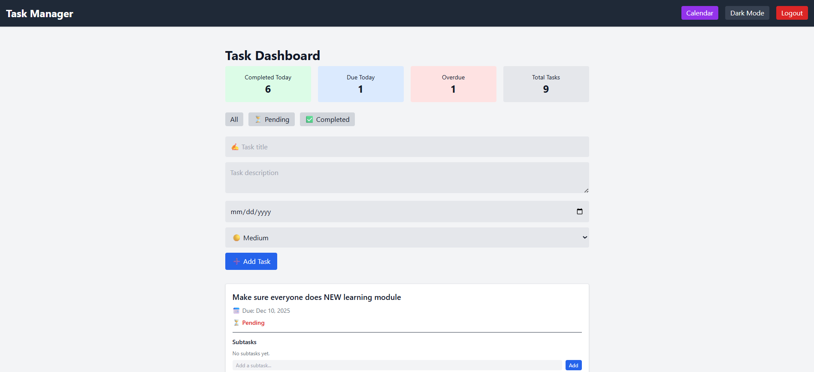
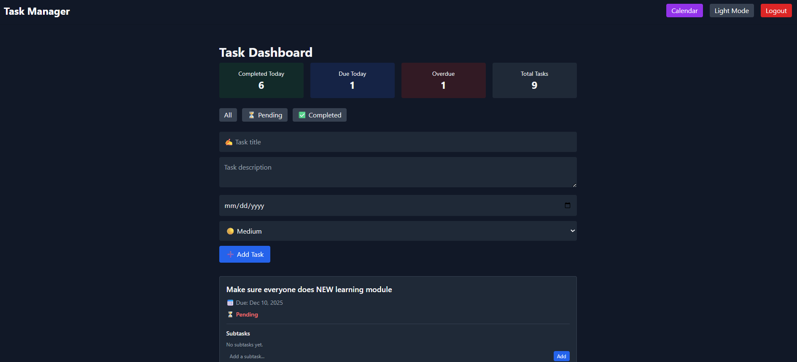
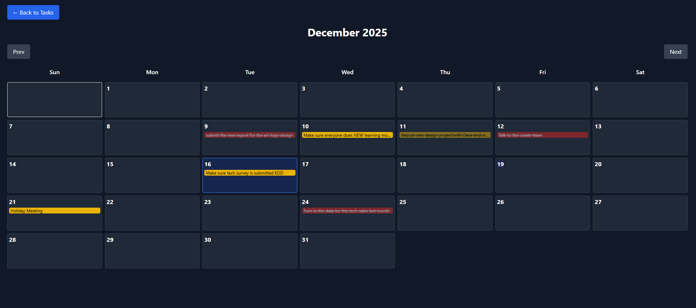

# 🗂️ Task Manager App

A full-stack task management application built with **React, Node.js, Express, and PostgreSQL**.  
The app allows users to organize tasks, manage subtasks, track deadlines, and visualize progress through a calendar view.

---
## 🎬 Demo


## 🚀 Project Description


This project was built to practice and demonstrate full-stack development concepts, including REST APIs, authentication, relational databases, and modern frontend UI patterns.

Users can create tasks, assign priorities and due dates, break tasks into subtasks, and track progress visually through both a dashboard and calendar view.

---

## ✨ Features


- ✅ Create, edit, delete, and complete tasks
- 🧩 Subtasks with **automatic parent task completion**
- 🎉 Confetti celebration when tasks are completed
- 📊 Dashboard stats:
  - Due Today
  - Overdue
  - Total Tasks
- 📅 Calendar view with task deadlines
- 🔍 Filter tasks by All / Pending / Completed
- 🌙 Dark mode support
- 🔐 JWT-based authentication
- 📱 Responsive design

---

##  Tech Stack

### Frontend
- React
- Vite
- Tailwind CSS
- Axios
- Day.js

### Backend
- Node.js
- Express.js
- PostgreSQL
- JWT Authentication
- CORS, dotenv, nodemon

---

## 🗂️ Project Structure

task-manager-app/
├─ backend/
│ ├─ controllers/
│ ├─ models/
│ ├─ routes/
│ ├─ middleware/
│ ├─ db/
│ ├─ server.js
│ ├─ .env
│ └─ package.json
├─ frontend/
│ ├─ src/
│ │ ├─ components/
│ │ ├─ pages/
│ │ └─ api/
│ ├─ public/
│ └─ package.json
├─ screenshots/
├─ README.md
└─ .gitignore


---

## 📸 Screenshots

### Dashboard



### Calendar View



---

## ⚙️ Installation & Setup

### Backend

```bash
cd backend
npm install
npm run dev


### Create a .env file inside backend:

PORT=5000
DATABASE_URL=your_postgres_url
JWT_SECRET=your_secret_key

Frontend

Copy code
cd frontend
npm install
npm run dev

### Future Improvements

- Weekly productivity stats
- Task streak tracking
- Drag-and-drop task ordering
- Notifications for upcoming deadlines

👤 Author

Armando Arellano
Full-Stack Developer


---

